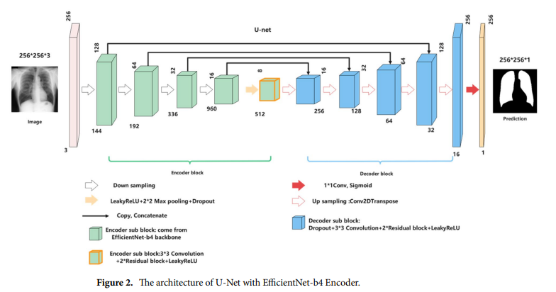

Automatic lung segmentation in chest X‑ray images using improved U‑Net  
개선된 U-Net을 사용한 흉부 X선 이미지의 자동 폐 분할  
2022 nature

이 논문의 목적은 기존 U-Net 모델을 개선하여 흉부 X-선 이미지에서 폐를 자동으로 분할하는 것까지임. 다중 분류가 목적이 아님을 인지할 것.

기존 U-Net 구조를 세 가지 측면에서 개선함.

1. 인코더 부분에 EfficientNet-B4를 사용
>- ImageNet 데이터로 사전 학습된 EfficientNet-B4 모델로 교체하여 특징 추출 성능 향상

2. 디코더에 잔차 블록(Residual Block) 도입.
>- 깊은 신경망에서 기울기(학습 신호)가 제대로 전달되지 않는 문제를 해결하기 위함.
>- 잔차 블록 내 skip-connection을 통해 기울기 소실 문제를 완화하고, 더 깊은 네트워크 학습 가능.

3. Leaky ReLU 활성화 함수 사용.
>- ReLU는 음수 입력에 대해 기울기가 0이 되어 뉴런이 죽는 문제 발생 가능.
>- Leaky ReLU는 음수 입력에 대해 작은 기울기를 유지하여 이 문제를 방지하고 학습의 안정성을 높임.

---

Multi-label chest X-ray image classification based on long-range dependencies capture and label relationships learning  
장거리 종속성 캡처 및 레이블 관계 학습을 기반으로 한 다중 레이블 흉부 X선 이미지 분류  
2025 science

맥락 인식, 해부학적 집중, 관계 추론.

