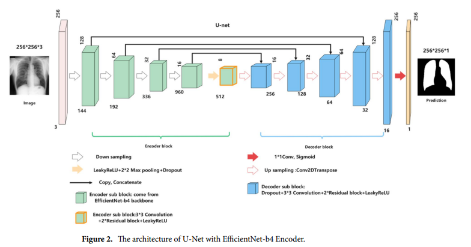
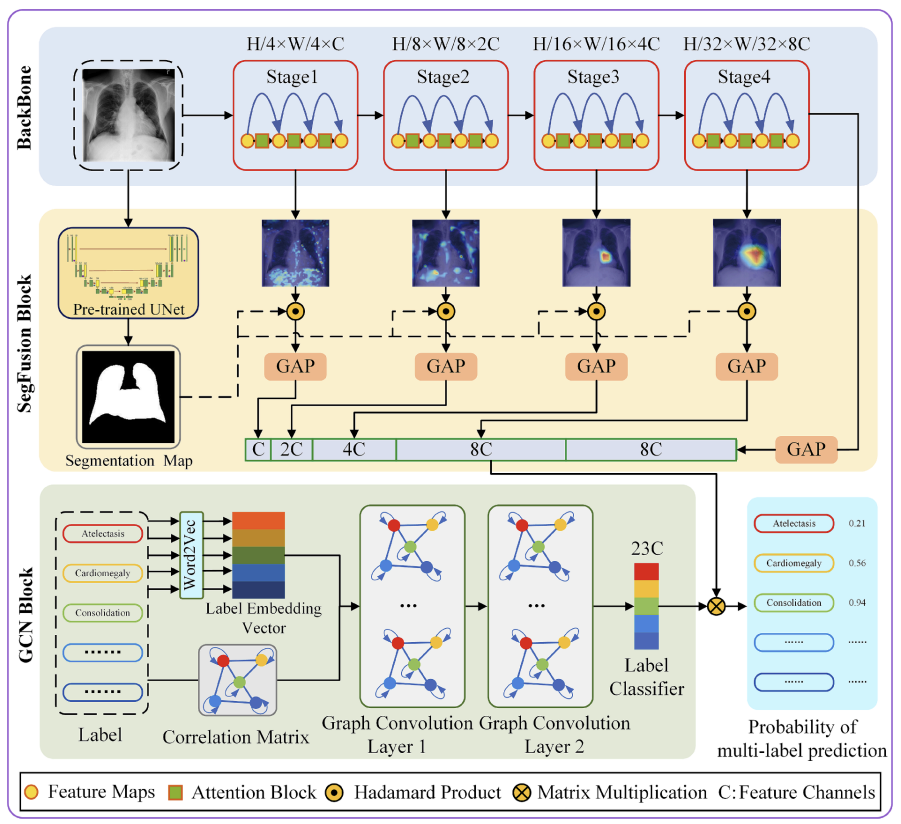
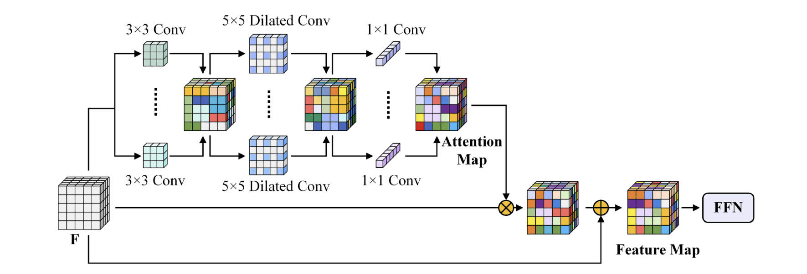

Automatic lung segmentation in chest X‑ray images using improved U‑Net  
개선된 U-Net을 사용한 흉부 X선 이미지의 자동 폐 분할  
2022 nature

이 논문의 목적은 기존 U-Net 모델을 개선하여 흉부 X-선 이미지에서 폐를 자동으로 분할하는 것까지임. 다중 분류가 목적이 아님을 인지할 것.

기존 U-Net 구조를 세 가지 측면에서 개선함.

1. 인코더 부분에 EfficientNet-B4를 사용
>- ImageNet 데이터로 사전 학습된 EfficientNet-B4 모델로 교체하여 특징 추출 성능 향상

2. 디코더에 잔차 블록(Residual Block) 도입.
>- 깊은 신경망에서 기울기(학습 신호)가 제대로 전달되지 않는 문제를 해결하기 위함.
>- 잔차 블록 내 skip-connection을 통해 기울기 소실 문제를 완화하고, 더 깊은 네트워크 학습 가능.

3. Leaky ReLU 활성화 함수 사용.
>- ReLU는 음수 입력에 대해 기울기가 0이 되어 뉴런이 죽는 문제 발생 가능.
>- Leaky ReLU는 음수 입력에 대해 작은 기울기를 유지하여 이 문제를 방지하고 학습의 안정성을 높임.

---

Multi-label chest X-ray image classification based on long-range dependencies capture and label relationships learning  
장거리 종속성 캡처 및 레이블 관계 학습을 기반으로 한 다중 레이블 흉부 X선 이미지 분류  
2025 science

맥락 인식, 해부학적 집중, 관계 추론.

1. 대형 커널 어텐션(LKA, Large Kernel Attention) 사용
>- 전문의처럼 X-rqy 이미지를 처음 봤을 때, 특정 부위(CNN의 필터)만 보는 한계를 극복하기 위해 장거리 의존성(long-range dependencies, 전체적인 균형과 미묘한 음영 차이를 훓어보며 넓은 맥락)을 파악함.

수용 영역의 확장
>- 입력 데이터 F가 하나의 Attention Block을 통과할 때 각각 5x5(지역적 정보 포착), 7x7(전역적 정보 포착), 1x1(채널 정보 결합) 크기의 커널을 사용해 특징맵을 추출함. 이로써 다양한 크기의 특징을 포착할 수 있음. 이때 합성곱연산이 진행될수록 각 뉴런은 훨씬 더 넓은 이미지 영역의 정보를 반영하고 있음. 이것을 수용영역(receptive field)이 넓어진다고 표현함.
>- 마지막 스테이지의 마지막 블럭 내 7x7커널은 이전 원본 1024x1024이미지의 매우 넓은 영역(전역적인 특징)에 해당하는 정보를 한번에 보게 됨.

다운샘플링(Downsampling)
>- 또한, 4개의 스테이지를 거치며 이미지의 해상도를 계속 절반으로 줄임.(H4 -> H/8 -> H/16 -> H/32). 해상도가 절반으로 줄어들 때마다, 다음 층의 커널이 보는 실질적인 시야는 두 배로 넓어짐.

LKA블록은 DWD-Conv, 깊이별 확장 합성곱 사용.
>- 

2. X-ray 이미지에서 중요한 부위는 어디인가?
>- 사전 학습된 U-Net을 이용해 폐와 심정 영역을 먼저 분할함. 그리고 이 영역에 LKA의 특징맵을 덧씌워 모델이 진단에 중요한 부위에 집중하도록 유도함.

3. 레이블 관계 학습
>- 특정 소견을 발견했을 때 질병 간의 연관성을 고려해 최종 진단의 신뢰도를 높임.
GCN을 통해 훈련 데이터에 나타난 질병들의 동시 발생 패턴을 학습함. 이는 이미지 자체와는 별개로, 질병 간의 관계를 모델이 이해하도록 돕는 역할을 함.