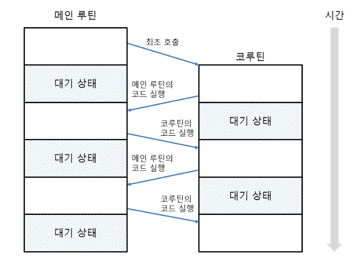

```python
def add(a, b): # 서브 루틴
    c = a + b    # add 함수가 끝나면 변수와 계산식은 사라짐
    print(c)
    print('add 함수')
 
def calc(): # 메인 루틴
    add(1, 2)    # add 함수가 끝나면 다시 calc 함수로 돌아옴
    print('calc 함수')
 
calc()
```
출력
```shell
3
add 함수
calc 함수
```

